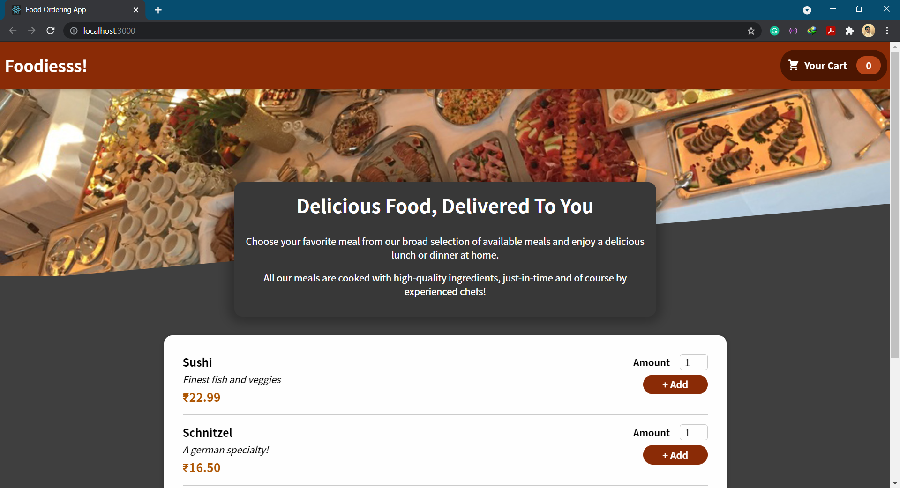
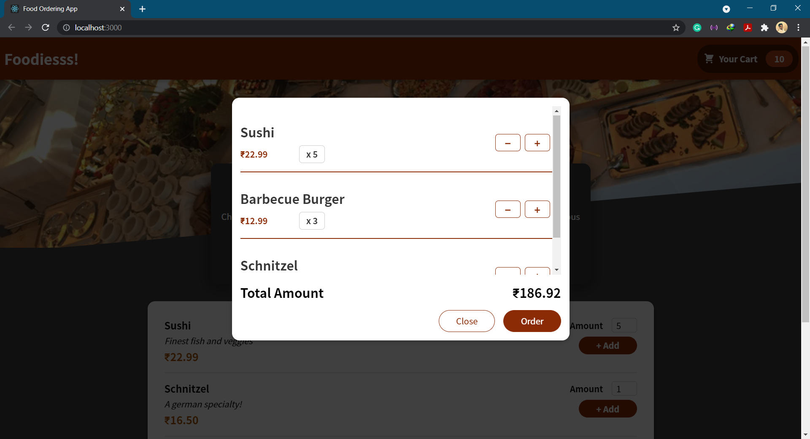
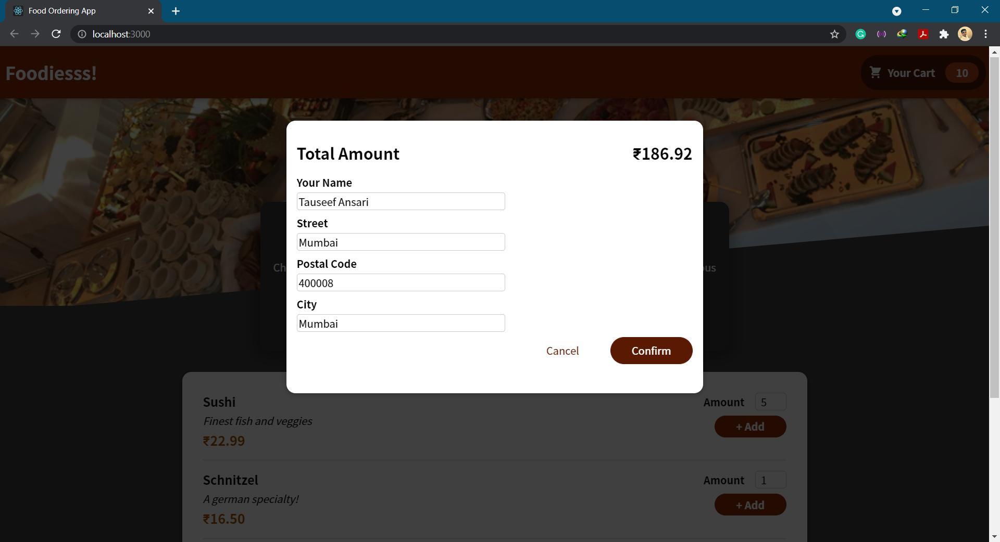
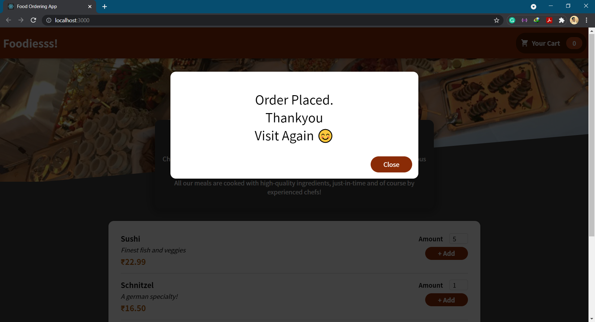

## Food-Order-App
 A Food Ordering App made using React JS along with Firebase as a backend Realtime Database 

 ## Actually want to use?
[Food Ordering System](https://foodsorders.netlify.app/) is a React JS based project developed while learning React and used backend as a Firebase

## Snapshots

